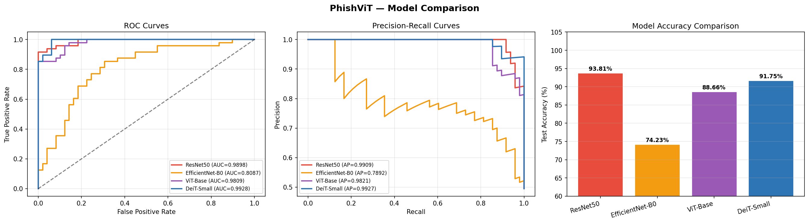
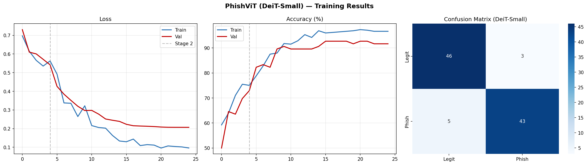
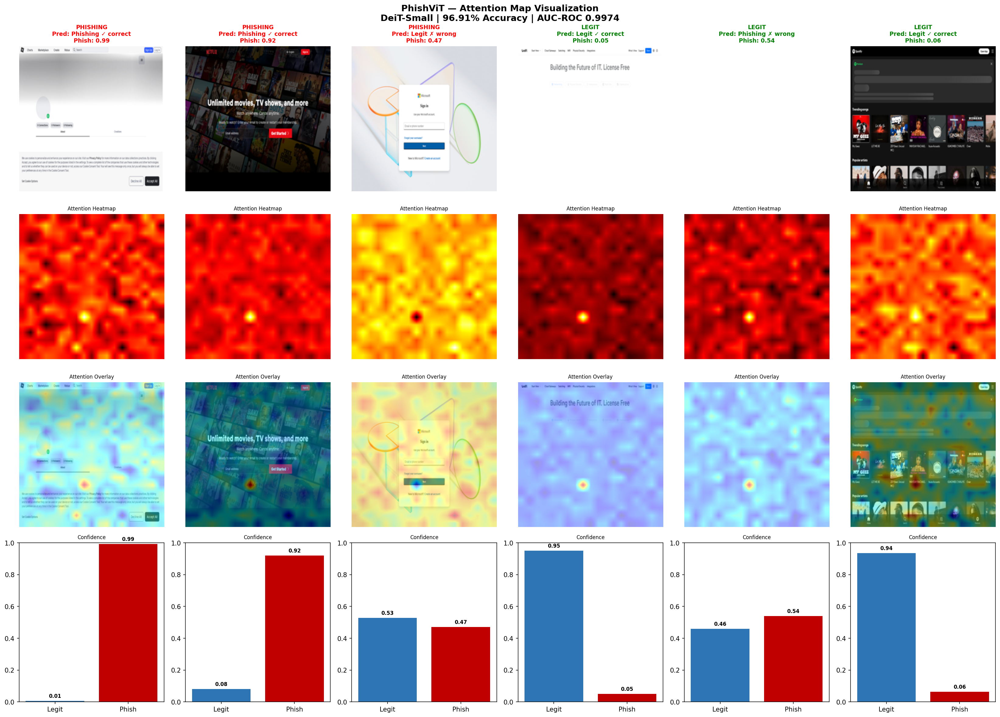

# PhishViT
# 🛡️ PhishViT: Real-Time Visual Phishing Detection Using Vision Transformers

[](https://python.org)
[](https://pytorch.org)
[](LICENSE)
[]()

**Author:** Jean Chrysostome NDAYISABYE  
**Institution:** University of Rwanda, College of Science and Technology  
**Department:** Information Systems | Kigali, Rwanda  
**Contact:** github.com/Chryso1392001

---

## 📌 Overview

PhishViT is a real-time phishing detection framework that operates on
**webpage screenshots** using a fine-tuned **DeiT-Small Vision Transformer**.
Unlike existing approaches that analyze URL strings or HTML source code,
PhishViT examines the **visual rendering layer** of webpages — the same
layer that human users perceive — making it robust against URL obfuscation,
punycode spoofing, and homograph attacks.

---

## 🚀 Development Journey: V1 → V2 → V3

| Phase | Dataset | Accuracy | F1 | AUC-ROC | Notes |
|-------|---------|----------|----|---------|-------|
| **V1** | 253 screenshots | 78.95% | 80.95% | 0.9363 | Initial prototype |
| **V2** | 642 screenshots | 96.91% | 96.91% | 0.9974 | Dataset expansion |
| **V3** | 642 screenshots | 91.75% | 91.49% | 0.9928 | Top-tier cross-validated evaluation |

> **Note:** V3 accuracy is lower than V2 because it uses stricter
> 5-fold cross-validation and multiple baseline comparisons under
> identical conditions — reflecting more conservative and statistically
> reliable performance estimates.

---

## 📊 V3 Baseline Comparison

| Model | Accuracy | F1 | AUC-ROC | Inference |
|-------|----------|----|---------|-----------|
| ResNet50 | 93.81% | 93.75% | 0.9898 | 5.81 ms |
| EfficientNet-B0 | 74.23% | 72.53% | 0.8087 | 30.46 ms |
| ViT-Base | 88.66% | 88.17% | 0.9809 | 15.55 ms |
| **DeiT-Small (PhishViT)** ⭐ | **91.75%** | **91.49%** | **0.9928** | **5.44 ms** |

---

## 🔁 5-Fold Cross-Validation (DeiT-Small)

| Metric | Mean | Std Dev |
|--------|------|---------|
| Accuracy | 85.23% | ±1.18% |
| F1-Score | 85.31% | ±2.01% |
| AUC-ROC | 0.9379 | ±0.0130 |
| Precision | 87.48% | ±4.41% |
| Recall | 85.16% | ±6.18% |

---

## 🛡️ Robustness Evaluation

| Perturbation | Accuracy | Drop |
|---|---|---|
| Clean (Baseline) | 91.75% | — |
| Gaussian Blur | 89.69% | −2.06% |
| Brightness +30% | 89.69% | −2.06% |
| Brightness −30% | 93.81% | +2.06% |
| Low Contrast | 92.78% | +1.03% |
| Random Rotation | 91.75% | 0.00% |

---

## 🧠 How It Works
1)URL Input
2)Playwright Headless Browser (screenshot capture)
3)224×224 px Preprocessed Image
4)DeiT-Small Vision Transformer (12 blocks, 6-head attention)
5)Binary Classification Head
6)PHISHING ⚠️  /  LEGITIMATE ✅
7)Attention Rollout Heatmap 🧠
---

## ⚡ Quick Start

### 1. Clone the repository
```bash
git clone https://github.com/Chryso1392001/PhishViT.git
cd PhishViT
```

### 2. Install dependencies
```bash
pip install -r requirements.txt
playwright install chromium
```

### 3. Run in Google Colab
Open `PhishViT_Training.ipynb` in Google Colab with **T4 GPU** enabled:
Runtime → Change runtime type → T4 GPU → Save

### 4. Dataset setup
Upload `phishvit_data_v2.zip` to your Google Drive at:
## 📸 Results

### Model Comparison


### V3 Training Curves & Confusion Matrix


### Attention Map Visualization


---

## 🗂️ Dataset

| Source | Type | Count |
|--------|------|-------|
| OpenPhish Community Feed | Phishing URLs | 321 |
| Tranco Top-1M | Legitimate URLs | 321 |
| **Total** | **Balanced dataset** | **642** |

Screenshots captured at 1280×800 resolution using Playwright headless browser.

---

## 📄 Paper

The full research paper is available in the `paper/` directory in three formats:

| Format | File | Description |
|--------|------|-------------|
| PDF | `PhishViT_V1_V2_V3_Final.pdf` | Ready-to-submit IEEE format |
| LaTeX | `PhishViT_V1_V2_V3_Final.tex` | Editable source |
| Word | `PhishViT_V1_V2_V3_Final.docx` | Editable document |

---

## 🔮 Citation

If you use this work, please cite:

```bibtex
@article{ndayisabye2026phishvit,
  title     = {PhishViT: Real-Time Visual Phishing Detection from
               Webpage Screenshots Using Vision Transformers},
  author    = {Ndayisabye, Jean Chrysostome},
  institution = {University of Rwanda},
  department  = {Department of Information Systems},
  year      = {2026},
  url       = {https://github.com/Chryso1392001/PhishViT}
}
```

---

## 🔮 Future Work

- Scale dataset to 10,000+ screenshots from PhishTank and APWG
- Adversarial robustness evaluation
- Multimodal fusion with URL lexical features
- Model compression for on-device inference
- Full browser extension implementation

---

## 📜 License

MIT License — see [LICENSE](LICENSE) for details.
